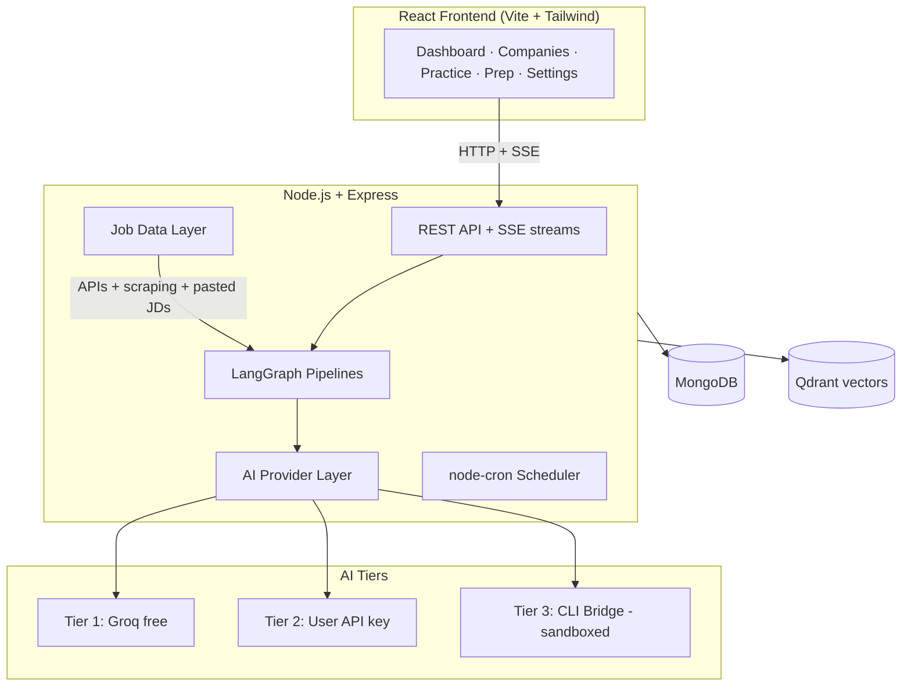
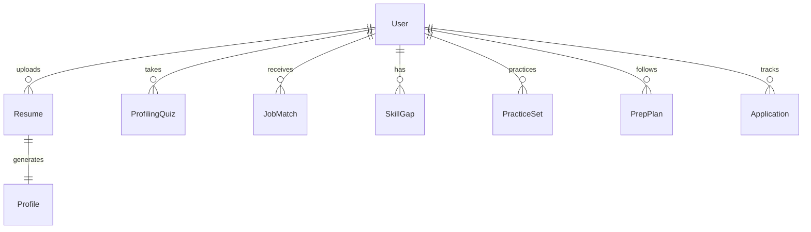
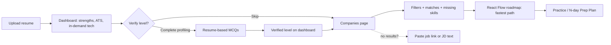

# CareerPilot AI — Project Guide

> The beginner-friendly learning and documentation file. Updated after every meaningful step. Companion files: `PLAN.md` (architecture blueprint), `PROJECT_CONTEXT.md` (AI/dev handoff), `MENTOR_PROTOCOL.md` (teaching rules).
>
> **Last updated:** 2026-07-29 · **Status:** Phase 0 scaffold written; server boot verified in Linux sandbox; not yet run on Saurabh's machine

---

## 1. Project Title

**CareerPilot AI** — an AI-powered career copilot for resume analysis, job matching, skill-gap roadmaps, and interview preparation.

## 2. Project Summary

A user uploads their resume (PDF). The app analyzes it with AI and shows a dashboard: strengths, in-demand technologies, ATS (Applicant Tracking System — the software companies use to auto-filter resumes) readiness, and role fit. The user can optionally verify their skill level through AI-generated MCQs (Multiple Choice Questions) built from their own resume. The app then matches them with companies and roles, shows exactly which skills they're missing, and generates roadmap.sh-style visual learning roadmaps for the fastest path to close each gap. A practice section offers standard, company-specific, and resume-based questions, plus time-boxed prep plans ("interview in 5 days"). Later phases add a voice AI mock interviewer, one-click mass apply, and cold outreach.

## 3. Why We Are Building This / Problem It Solves

Candidates rarely know *why* their resume gets rejected, *which* skills actually block them from a role, or *how* to prepare efficiently under time pressure. Feedback is manual, scattered, and generic. CareerPilot AI combines resume understanding (RAG — Retrieval-Augmented Generation, explained in the glossary), live job-market data, and AI generation into one guided experience.

## 4. Target Users

Students and early/mid-career job seekers, especially those targeting tech roles, who want honest skill assessment and structured, time-efficient preparation.

## 5. Expected Outcomes

For users: clear skill picture, targeted company matches, fastest-path learning roadmaps, structured interview prep. For Saurabh: deep hands-on learning of full-stack development, RAG systems, LangChain/LangGraph, vector databases, and desktop app packaging — with recruiter-ready explanations of every part.

## 6. Main Features

Resume upload + parsing → live dashboard; optional MCQ profiling (skippable); company/role matching with filters; skill-gap detection + interactive React Flow roadmaps; practice modes (standard / company-specific / resume-based); N-day prep plans with scheduling; tiered AI providers (free Groq → own API key → CLI subscription bridge with sandboxed "Heavy Mode"); manual fallbacks (paste job link, paste JD text); future: voice interviewer, mass apply, cold outreach.

## 7. Functional Requirements

FR1 Upload PDF resume, extract and structure content. FR2 Generate dashboard metrics (strengths, in-demand tech, ATS score, role fit). FR3 Generate resume-based MCQs with explanations; user can skip. FR4 Match jobs/companies from live sources; rank by fit; per-job missing skills. FR5 Accept pasted job URL or JD text (single/bulk) as alternatives to automatic sources. FR6 Filter jobs (date, company, role, location/remote, salary, match score). FR7 Generate skill-gap roadmaps with resources and time estimates, rendered as interactive graphs. FR8 Generate practice question sets, track progress, adapt difficulty. FR9 Generate day-wise prep plans from company + interview date; remind on schedule. FR10 Let user choose AI tier; encrypted key storage; CLI bridge with sandbox and explicit Heavy Mode.

## 8. Non-Functional Requirements

$0 infrastructure at every stage; every AI output schema-validated before display (no broken UI ever); graceful fallback chain across AI tiers; retries with backoff on all external calls; per-page error boundaries; SSE auto-reconnect and resumable pipelines; secrets encrypted at rest, never logged; responsive, polished UI; docs always in sync with code.

## 9. Technology Stack — What, Why, Alternatives

| Layer | Choice | Why | Alternatives considered |
|---|---|---|---|
| Frontend | React 18 + Vite | Component model fits the dashboard-heavy UI; Vite = instant dev server | Next.js (SSR unneeded — this becomes a desktop app), Angular (heavier learning curve) |
| Styling | Tailwind CSS | Fast to build a polished custom design | plain CSS/SCSS (slower), MUI (generic look) |
| Charts | Recharts | Simple declarative charts for dashboard metrics | Chart.js, Victory |
| Roadmap graphs | **React Flow** | Purpose-built node/edge graphs → roadmap.sh-style visuals with progress states, expandable nodes | Raw D3 (10x more work for same result; kept in reserve for custom visuals) |
| Animation | GSAP | Professional micro-interactions and page transitions | Framer Motion |
| State | Zustand | Tiny, no boilerplate | Redux (overkill), Context (re-render issues at scale) |
| Backend | Node.js + Express | Same language as frontend; huge ecosystem; Electron-friendly | Fastify (fine too), Python/FastAPI (splits the stack into two languages) |
| Database | MongoDB (local dev / Atlas free demo) | Flexible documents fit varied resume/job shapes; README requirement; free tiers | PostgreSQL (relational rigor not needed yet), SQLite (evaluated for Electron phase) |
| Vector DB | Qdrant (local Docker / Cloud free) | Fast similarity search for RAG; free 1GB cloud tier | Pinecone (paid pressure), pgvector, LanceDB (Electron-phase candidate) |
| Embeddings | fastembed (bge-small, runs locally) | Free, no API cost, good quality for resumes | OpenAI embeddings (costs money) |
| AI orchestration | LangChain + LangGraph | Pipeline/graph model matches our multi-step flows; README requirement | Raw SDK calls (less structure, more glue code) |
| Default LLM | Groq free tier (llama-3.3-70b) | $0, extremely fast inference | Gemini free tier (backup), local Ollama (heavy for users' PCs) |
| Validation | zod | Runtime schema validation of every AI output — the robustness backbone | Joi, Yup |
| Streaming | SSE (Server-Sent Events) | One-directional server→client streaming fits LLM tokens + progress; auto-reconnect built in | WebSockets (only needed for bidirectional voice — added in Phase 7) |
| Scraping | Cheerio (static) + Playwright (JS pages) | Free; covers both page types | Paid scraping AI (Ernie) — unnecessary, our LLM normalizes raw data |
| Job APIs | JSearch, Adzuna, Remotive | Free tiers, decent India + global coverage | LinkedIn (no public API, ToS risk as primary) |
| Scheduler | node-cron (web) → Electron main process (desktop) | Simple in-process scheduling; native notifications at desktop stage | BullMQ (needs Redis — violates $0 simplicity) |
| Desktop | Electron (Phase 6) | Chromium+Node = our stack runs unchanged; bundled terminal via xterm.js | Tauri (Rust learning curve, weaker Node integration for CLI bridge) |

## 10. Architecture



Plain language: the React app talks to one Express server over normal HTTP requests, and the server streams AI answers back live over SSE. The server runs AI pipelines (LangGraph) that can use any of three AI "tiers", pull job data, and store everything in MongoDB (documents) and Qdrant (embeddings for semantic search). Full detail: `PLAN.md` §3–§6.

## 11. Folder & File Structure (planned)

```text
CareerPilot_AI/
├─ client/          React app (see PLAN.md §9 for pages/components)
├─ server/          Express API, pipelines, provider layer, job data layer
├─ shared/          zod schemas shared by client + server
├─ bridge/          CLI agent sandbox (context.md, inbox/, outbox/, AGENT.md)
├─ docker-compose.yml   local MongoDB + Qdrant
├─ PLAN.md · PROJECT_GUIDE.md · PROJECT_CONTEXT.md · MENTOR_PROTOCOL.md · CLAUDE.md
```

## 12. Database Design

Collections and fields: `PLAN.md` §7. Key relationships:



## 13. API Design

Full contract: `PLAN.md` §8. Pattern: REST for actions, SSE endpoints for anything that streams (parsing progress, AI generation, bridge terminal output).

## 14. User Flow



## 15. Data Flow (resume ingestion)

PDF → text extraction (pdf-parse) → cleaning → chunking (~500 tokens) → local embeddings (fastembed) → Qdrant storage → structured extraction (skills/projects/experience via LLM + zod) → MongoDB → dashboard generation. Each stage reports progress over SSE so the user watches it live.

## 16. Authentication & Authorization

Single-user local app initially — no login. The ChatGPT Assisted Mode (Phase 7) uses the *user's own* ChatGPT login inside an embedded browser tab; we never handle those credentials. If the web demo goes multi-user later: JWT (JSON Web Token) auth — decision deferred, flagged in PROJECT_CONTEXT.md.

## 17. Security Considerations

User API keys encrypted at rest (AES, machine-bound key), never logged or transmitted to third parties. CLI bridge runs sandboxed — writable only inside `bridge/`; "Heavy Mode" requires explicit per-session user approval and shows diffs before applying changes. All external input (scraped pages, pasted JDs, AI output) validated before storage/display.

## 18. Deployment Process

`PLAN.md` §14. Summary: dev fully local ($0, docker-compose), demo on Vercel + Render + Atlas + Qdrant Cloud free tiers ($0), final Electron desktop build fully local ($0, no servers).

## 19. Testing Strategy

Vitest for unit tests (schemas, provider layer, normalizers), Supertest for API routes, fixture resumes/JDs for pipeline tests, manual checklist per phase. AI outputs tested by schema conformance (not exact text). Details added as each phase lands.

## 20. Common Errors & Solutions

- **`GROQ_API_KEY is missing`** on server start → you haven't created `server/.env`. Copy `server/.env.example` to `server/.env` and paste your free key from console.groq.com.
- **`node: bad option: --env-file`** → Node version too old. This project needs Node 20.6+. Check with `node --version`.
- **Dashboard shows "Backend unreachable"** → the server isn't running. Run `npm run dev:server` (or `npm run dev` for both) and check its terminal for errors.
- **`EADDRINUSE: port 3001`** → something else uses the port. Change `PORT` in `server/.env` AND the proxy target in `client/vite.config.js` to match.
- **`docker compose up` fails** → Docker Desktop isn't running. Start it first. (DBs aren't needed until Phase 1, so Phase 0 works without Docker.)
- **`/api/ai/test` returns `Groq API error 401`** → key is wrong/revoked. `429` → free-tier rate limit, wait a minute (the fallback queue that handles this automatically comes in Phase 1).

## 21. Future Improvements

Voice AI interviewer (3 tiers, PLAN.md §12), resume tailoring per job, one-click mass apply, cold email + LinkedIn outreach, application tracking analytics, mobile companion.

## 22. Limitations

Free-tier rate limits (mitigated by caching/queueing); scraping can break (mitigated by paste-link/paste-JD fallbacks); Web Speech voice quality below ChatGPT's; Render free tier sleeps when idle (demo only); ChatGPT Assisted Mode depends on OpenAI's UI staying scrape-friendly for transcripts.

## 23. Recruiter / Interview Explanation

"I built a full-stack AI career platform: it parses resumes into a vector database for RAG-based analysis, matches candidates against live job-market data, and generates adaptive interview prep. The interesting engineering: a tiered AI provider layer where users can bring an API key or connect a CLI subscription agent through a sandboxed file-based bridge protocol; schema-validated AI outputs for reliability; SSE streaming; and an Electron desktop build with local-first data." (Per-phase versions added as phases complete.)

## 24. Glossary

- **ATS** (Applicant Tracking System): software that auto-filters resumes by keywords before a human sees them.
- **RAG** (Retrieval-Augmented Generation): instead of asking the AI from memory, we first *retrieve* the most relevant stored text (resume chunks) and feed it into the prompt — grounded, accurate answers.
- **Embedding**: a list of numbers representing text meaning; similar meanings → nearby numbers. Enables "find resume parts similar to this JD".
- **Vector database**: a database (Qdrant here) optimized to store embeddings and find nearest ones fast.
- **Chunking**: splitting long text into pieces small enough to embed and retrieve precisely.
- **LLM** (Large Language Model): the AI text model (e.g., Llama 3.3 via Groq).
- **SSE** (Server-Sent Events): a kept-open HTTP response the server pushes events through; one-directional, auto-reconnects.
- **WebSocket**: two-way persistent connection; needed only for real-time bidirectional flows like voice.
- **JD** (Job Description). **MCQ** (Multiple Choice Question). **CLI** (Command-Line Interface). **BYO** (Bring Your Own). **TTL** (Time To Live — cache expiry). **STT/TTS** (Speech-To-Text / Text-To-Speech). **ToS** (Terms of Service). **JWT** (JSON Web Token). **AES** (Advanced Encryption Standard). **DOM** (Document Object Model — a web page's live structure). **API** (Application Programming Interface). **ERD** (Entity Relationship Diagram).
- **LangChain / LangGraph**: libraries for composing LLM calls into pipelines / graphs with steps, retries, and state.
- **zod**: a library that checks at runtime that data matches an exact expected shape.

## 25. Phase-by-Phase Record

| Phase | Status | Notes |
|---|---|---|
| Planning & architecture | ✅ Completed 2026-07-29 | PLAN.md finalized after two review rounds with Saurabh (voice tiers, $0 deploy, SSE choice, fallbacks, filters, React Flow) |
| 0 Foundation | 🔵 In progress (2026-07-29) | Scaffold written: npm-workspaces monorepo (client/server/shared), Express + pino + central error handler, GroqProvider with zod-validated `json()` + 1 retry, Vite+React+Tailwind shell with sidebar + 4 pages + health card, docker-compose (Mongo+Qdrant), .gitignore (secrets, internal docs, bridge runtime). **Verified in Linux sandbox:** `npm install` clean, server boots, `/api/health` responds, error handler returns clean JSON. **Pending verification on Saurabh's machine:** full `npm run dev` with real Groq key. Old root `index.js` is obsolete — delete manually. |
| 1 Resume → Dashboard | ⬜ | |
| 2 Profiling MCQs | ⬜ | |
| 3 Jobs & Skill Gaps | ⬜ | |
| 4 Practice + Prep Plans | ⬜ | |
| 5 CLI Agent Bridge | ⬜ | |
| 6 Electron wrap | ⬜ | |
| 7 Voice + growth features | ⬜ | |
